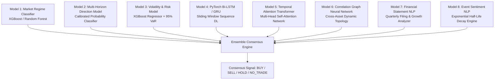

# ENSEMBLE_ARCHITECTURE.md — 8-Model Multi-Horizon Quantitative AI Ensemble

**Platform**: NexQuant Quantitative Intelligence  
**Author**: Machine Learning & Quantitative Development Team  
**System Version**: 2.2.0-Production  

---

## 1. Executive Summary

NexQuant's prediction engine does not rely on a single monolithic neural network or basic trend-following heuristic. Financial markets exhibit regime shifts, non-stationarity, and varying signal-to-noise ratios across time horizons. 

NexQuant aggregates signals from **8 specialized, horizon-aware quantitative models** spanning statistical classifiers, recurrent networks, multi-head attention transformers, geometric deep learning, and natural language processing.

---

## 2. The 8 Specialized AI Models

### Model 1: Market Regime Classifier (`src/models/regime/regime_classifier.py`)
- **Architecture**: Gradient Boosted Decision Trees (XGBoost) with 23 technical and candlestick pattern inputs.
- **Output**: Calibrated triple-class probabilities: Bullish ($P_{\text{bull}}$), Bearish ($P_{\text{bear}}$), Sideways ($P_{\text{side}}$).
- **Horizon Adaptation**: Forward return horizon dynamically scales from 2 candles ($\pm 0.40\%$ threshold for Scalper) to 30 candles ($\pm 6.00\%$ threshold for Investor).

### Model 2: Multi-Horizon Price Direction (`src/models/direction/direction_model.py`)
- **Architecture**: Multi-head probabilistic directional classifiers.
- **Output**: Binary probability distributions over specific target candle spans.
- **Horizon Adaptation**: Configured with target horizons $[1, 2, 3]$ candles (Scalper), $[3, 5, 8]$ (Intraday), $[5, 10, 20]$ (Swing), and $[20, 40, 60]$ (Investor).

### Model 3: Volatility & Risk Scoring Model (`src/models/volatility/volatility_model.py`)
- **Architecture**: Gradient Boosted Regressor forecasting annualized forward standard deviation $\sigma_{\text{fwd}}$.
- **Output**: Expected Volatility, Volatility Regime (Low, Medium, High, Extreme), and Risk Score ($0 - 100$).
- **Horizon Adaptation**: Volatility label formulation scales with the horizon window, preventing false high-volatility flags during normal intraday noise.

### Model 4: PyTorch Bi-LSTM / GRU (`src/models/lstm/lstm_model.py`)
- **Architecture**: 2-layer Bidirectional LSTM with Layer Normalization and Dropout ($p=0.30$).
- **Input Dimension**: Normalized sliding tensor $(N, T, 10)$.
- **Horizon Adaptation**: Sliding sequence length adapts dynamically: $T=12$ (Scalper), $T=24$ (Intraday), $T=40$ (Swing), $T=60$ (Investor).

### Model 5: Temporal Attention Transformer (`src/models/transformer/transformer_model.py`)
- **Architecture**: Multi-Head Self-Attention Encoder with sinusoidal positional embeddings.
- **Attention Dimension**: $d_{\text{model}} = 64$, 4 attention heads, feedforward dimension 128.
- **Horizon Adaptation**: Temporal context lookback scales up to $T=80$ bars for long-term compound trend identification.

### Model 6: Market Graph Neural Network (`src/models/gnn/gnn_model.py`)
- **Architecture**: 2-layer Graph Convolutional Network (GCN) operating on dynamically weighted correlation adjacency matrices.
- **Topology**: Cross-asset node features capturing systemic market contagion, sector rotation, and correlation breakdowns.
- **Horizon Adaptation**: Weighted higher for Macro Investors (15%) and Swing Traders (8%) than for high-frequency Scalpers (5%).

### Model 7: Financial Statement NLP (`src/models/financial_nlp/financial_nlp.py`)
- **Architecture**: Rule-governed and lexical scoring of balance sheet disclosures, revenue growth, debt-to-equity leverage, and net margin trajectory.
- **Horizon Adaptation**: **0% weight in Scalper mode** (bypassed), **2% in Intraday**, **10% in Swing**, and **25% dominant weight in Investor mode**.

### Model 8: Event Sentiment & News NLP (`src/models/news_nlp/news_nlp.py`)
- **Architecture**: Real-time multi-source financial wire sentiment with exponential half-life decay.
- **Event Detection**: 11 deterministic financial event taxonomy matchers.
- **Horizon Adaptation**: Half-life decays aggressively in 2 hours for Scalpers, 8 hours for Intraday, 3 days for Swing, and 30 days for Investors.

---

## 3. Quantitative Ensemble Formulation

The final ensemble probability distribution is computed via normalized convex combination:

$$P_{\text{ensemble}}(C) = \frac{\sum_{m=1}^8 W_m(S) \cdot P_m(C)}{\sum_{m=1}^8 W_m(S)}, \quad C \in \{\text{Bullish}, \text{Bearish}, \text{Sideways}\}$$

Where $W_m(S)$ represents the dynamic weight of model $m$ under active trading style $S$.

### Circuit Breakers & Risk Overrides
1. **Value-at-Risk Override**: If the estimated 95% VaR exceeds 85.0 or volatility regime is designated `EXTREME`, the signal is forced to `NO_TRADE`.
2. **Confidence Threshold**: Signals require at least $55\%$ directional consensus probability; otherwise, a prudent `HOLD` is assigned.
